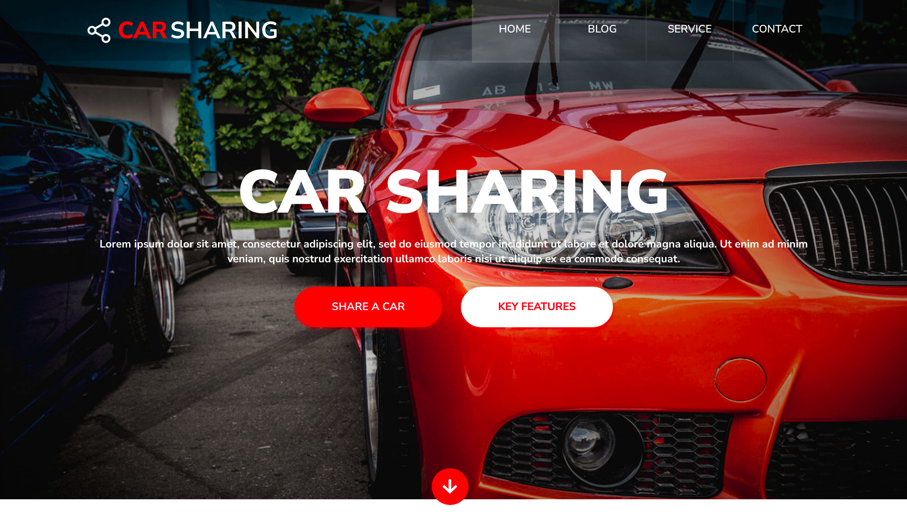

# Car-Sharing

> Portfolio Lab project

## Table of contents

- [General info](#general-info)
- [Screenshots](#screenshots)
- [Technologies](#technologies)
- [Setup](#setup)
- [Features](#features)
- [Status](#status)
- [Contact](#contact)

## General info

This is my first project made with HTML and CSS.
The aim of the project is to create type 'one-page' for the car rental business model where it is possible to rent a car for a short time.
The project will be a **website** based on the layout that was prepared in Adobe XD

## Screenshots

## Technologies

- HTML
- CSS
- Block Element Modifier (BEM)
- Reset file
- Adobe XD
- ITCSS (organizational issues, layered structure)

## Setup

This project runs when a file is selected: index.html

## Features

- Organization of styles (scope of responsibility of a given class), specificity of selectors
- Global styles (variables, reset, h1 styles etc)
- Component styles (buttons, headers)
- Local styles (sections, pages, etc.)
- Partial files are imported into the main style.css file

## Status

Project is: _made_

## Contact

Created by Krystian Marciniak krystianmarciniak446@gmail.com - feel free to contact me

