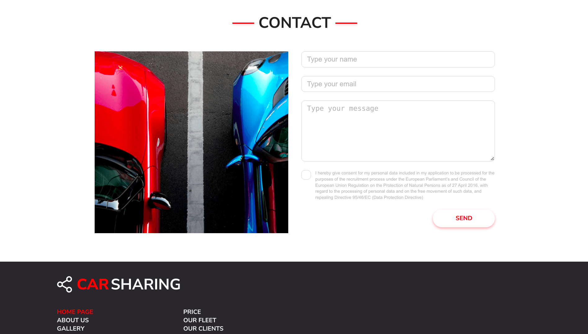

# Car-Sharing

> Portfolio Lab project

## Table of contents

* [General info](#general-info)
* [Screenshots](#screenshots)
* [Technologies Used](#technologies-used)
* [Features](#features)
* [Setup](#setup)
* [Project Status](#project-status)
* [Room for Improvement](#room-for-improvement)
* [Acknowledgements](#acknowledgements)
* [Contact](#contact)

## General info

This is my first project made with HTML and CSS.
The aim of the project is to create type 'one-page' for the car rental business model where it is possible to rent a car for a short time.
The project will be a **website** based on the layout that was prepared in Adobe XD

## Screenshots

## Technologies Used

- HTML
- CSS
- Block Element Modifier (BEM)
- Reset file
- Adobe XD
- ITCSS (organizational issues, layered structure)

## Features

- Organization of styles (scope of responsibility of a given class), specificity of selectors
- Global styles (variables, reset, h1 styles etc)
- Component styles (buttons, headers)
- Local styles (sections, pages, etc.)
- Partial files are imported into the main style.css file

## Setup

This project runs when a file is selected: index.html,
launched in the browser

## Project Status

Project is: _in progress_

## Room for Improvement

List of features ready and TODOs for future development

- Home Page and Form layout

To-do list:

- Mobile version
- Optimisation

## Contact

Created by Krystian Marciniak krystianmarciniak446@gmail.com - feel free to contact me!
