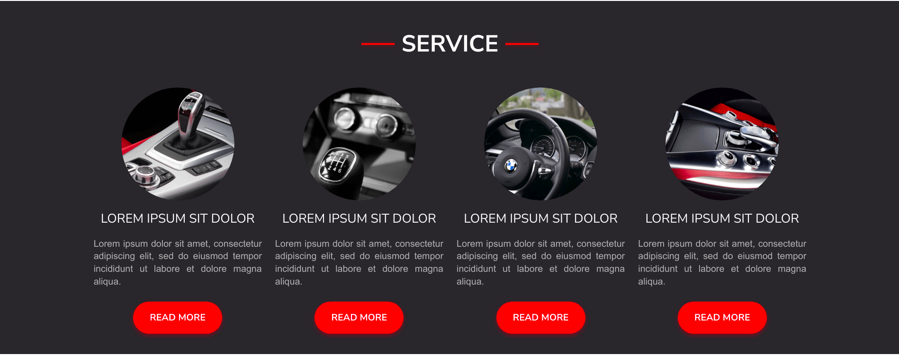

# Car-Sharing

> Portfolio Lab project

## Table of contents

- [General info](#general-info)
- [Screenshots](#screenshots)
- [Technologies](#technologies)
- [Setup](#setup)
- [Features](#features)
- [Status](#status)
- [Contact](#contact)

## General info

The aim of the project is to create type 'one-page' for the car rental business model where it is possible to rent a car for a short time.
The project will be a **website** based on the layout that was prepared in Adobe XD

## Screenshots

